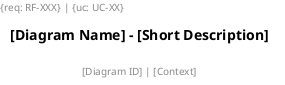

# 📊 PlantUML Diagram Generator — Professional Engineering Standard

[](https://opensource.org/licenses/MIT)
[](#)
[](#)

A professional-grade, highly structured custom skill designed to govern AI coding agents (such as Google Antigravity, Claude Engineer, etc.) in generating, auditing, and improving UML diagrams. 

It enforces compliance with **108 strict UML modeling rules** across 7 primary diagram types and integrates a **UML Maturity Scorecard** (Platinum, Gold, Silver, Bronze) to transition AI behavior from simple "diagram drawing" to formal "model engineering".

---

## 🌟 Key Capabilities

*   **📐 7 Diagram Models Supported:** Complete rule sheets for Use Case (UC), Sequence (SQ), Activity (AC), Class (CL), Component (COMP), Deployment (DP), and State Machine (ST) diagrams.
*   **🏆 UML Maturity Scorecard:** Automatically scores generated diagrams out of 108 points. Refuses generation of low-quality models (< 80 points) and targets Gold level (≥ 95 points) or Platinum (108 points).
*   **🔗 Bidirectional Traceability:** Enforces linking every diagram element to functional/non-functional requirements (RF/RNF IDs) or Use Case definitions.
*   **🛡️ Context-Aware Modeling:** The agent must define the audience, purpose, and abstraction level (domain vs implementation) before rendering syntax.
*   **🧩 Boilerplate Skinparam & Glossary:** Incorporates standard look-and-feel (skinparam) and a consistent vocabulary to avoid formatting chaos.

---

## 📁 Repository Structure

```text
plantuml-generator/
├── SKILL.md                 # Main entry point and diagram routing map
├── README.md                # General documentation
├── install.ps1              # Automation installer for Windows (PowerShell)
├── install.sh               # Automation installer for Unix/macOS (Bash)
├── .gitignore               # Ignored system files
└── references/              # Rule specifications by diagram type
    ├── quality_gate.md      # Self-audit checks (QG1 to QG8) and score matrix
    ├── plantuml_reference.md# Standard skinparam configs and syntax reference
    ├── rules_use_case.md    # Use Case modeling rules (UC1 to UC11)
    ├── rules_sequence.md    # Sequence diagram modeling rules (SQ1 to SQ12)
    ├── rules_activity.md    # Activity flow rules (AC1 to AC13)
    ├── rules_class.md       # Class & relations structural rules (CL1 to CL15)
    ├── rules_component.md   # Component layer rules (COMP1 to COMP10)
    ├── rules_deployment.md  # Deployment mapping rules (DP1 to DP10)
    └── rules_state.md       # State Machine transition rules (ST1 to ST11)
```

---

## 🚀 Easy Installation Guide

You can install this skill either **globally** (for use across all your projects) or **locally** (specific to a single project).

### Method 1: Automated Script (Fastest)

1. Clone this repository to your computer:
   ```bash
   git clone https://github.com/<your-username>/plantuml-generator.git
   cd plantuml-generator
   ```

2. Run the installer script matching your operating system:
   * **Windows (PowerShell):**
     ```powershell
     Set-ExecutionPolicy -Scope Process -ExecutionPolicy Bypass
     .\install.ps1
     ```
   * **macOS / Linux (Bash):**
     ```bash
     chmod +x install.sh
     ./install.sh
     ```
   
   The interactive installer will ask whether you want a **Global** or **Local** installation.

---

### Method 2: Manual Installation

#### A. Global Installation (Recommended for personal development)
Installing globally allows Gemini/Antigravity to access these rules on *any* project folder.

* **Windows:** Copy the contents of this repository to:
  `C:\Users\<Your-Username>\.gemini\config\skills\plantuml-generator\`
* **macOS / Linux:** Copy the contents of this repository to:
  `~/.gemini/config/skills/plantuml-generator/`

#### B. Local Workspace Installation (Recommended for project teams)
Copy the contents of this repository to:
`<your-project-root>/.agents/skills/plantuml-generator/`

---

## 📐 Mandatory Diagram Template

Any diagram produced under this ruleset must conform to the following boilerplate structure:



---

## 🤝 Contribution Guidelines

Contributions are welcome! If you want to propose adjustments to the modeling rules or skinparams, please open a PR explaining the engineering justification behind the update.

## 📄 License

This project is licensed under the MIT License - see the LICENSE file for details.
