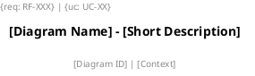

# PlantUML Diagram Generator — Professional Engineering Standard

**Skill ID:** ARCH-SKILL-PLANTUML-01 | **Version:** 1.0 | **Status:** Definitive  
**Authority:** Subordinate to all Layers 0–14 of `architect-ruleset`. No rule here overrides higher layers.

---

## 🧭 Semantic Task Router

Use this table to load only the rules relevant to the requested diagram type:

| Task | Reference File |
|------|---------------|
| Use Case Diagram | [rules_use_case.md](./references/rules_use_case.md) |
| Sequence Diagram | [rules_sequence.md](./references/rules_sequence.md) |
| Activity Diagram | [rules_activity.md](./references/rules_activity.md) |
| Class Diagram | [rules_class.md](./references/rules_class.md) |
| Component Diagram | [rules_component.md](./references/rules_component.md) |
| Deployment Diagram | [rules_deployment.md](./references/rules_deployment.md) |
| State Machine Diagram | [rules_state.md](./references/rules_state.md) |
| Quality Audit / Scorecard | [quality_gate.md](./references/quality_gate.md) |
| PlantUML Syntax / Skinparam / Glossary | [plantuml_reference.md](./references/plantuml_reference.md) |

---

## 🔑 Meta-Rules (Always Active)

### MR-01 – Engineering Mindset
Operate as a **Model Engineer**, not a diagram drawer. Every modeling decision must be justified by:
- Functional/non-functional requirements.
- Adopted architectural patterns.
- Software engineering practices (SOLID, GRASP, DDD, Clean Architecture).
- Bidirectional traceability between models and code.

### MR-02 – Context Before Generation
Before generating any diagram, clarify or infer:
- **Purpose**: analysis / design / deployment / communication?
- **Audience**: stakeholders / developers / architects / infra team?
- **Abstraction level**: domain / design / implementation / deployment?
- **Covered requirements**: RF/RNF IDs.
- **System state**: greenfield / brownfield / legacy?

### MR-03 – Traceability (Non-Negotiable)
Every diagram element must include traceability metadata:
- `{req: RF-XXX}` — linked requirement ID.
- `{uc: UC-XX}` — realized use case.
- Version, date, and author in the header.

### MR-04 – Gold Level Minimum
Generate diagrams scoring **≥ 95 / 108** on the UML Maturity Scorecard (Gold level).  
Reject diagrams scoring **< 80** with a written justification.

---

## 📐 Mandatory Header Template

Every `.puml` file must start with:



---

## 📁 File Naming Convention

| Diagram Type | Pattern | Example |
|---|---|---|
| Use Case | `uc_[ID]_[short-name].puml` | `uc_UC05_realizar-pedido.puml` |
| Sequence | `sq_[ID]_[scenario].puml` | `sq_UC05_pagamento-aprovado.puml` |
| Activity | `ac_[ID]_[process].puml` | `ac_UC05_processar-pedido.puml` |
| Class | `cl_[layer]_[context].puml` | `cl_domain_ecommerce.puml` |
| Component | `comp_[layer]_[system].puml` | `comp_service_ecommerce.puml` |
| Deployment | `dp_[env]_[system].puml` | `dp_prod_ecommerce.puml` |
| State | `st_[Class]_states.puml` | `st_Pedido_states.puml` |

---

## 🏆 Maturity Scorecard Summary

| Score | Level | Action |
|-------|-------|--------|
| 108 | **Platinum** | Deliver directly to dev team |
| 95–107 | **Gold** | Fix non-conformant items, then deliver |
| 80–94 | **Silver** | Review required before coding |
| < 80 | **Bronze** | Rework the model |

**Total rules: 108** (UC1–11, SQ1–12, AC1–13, CL1–15, COMP1–10, DP1–10, ST1–11, QG1–8 + MR1–4 + header/naming/skinparam).

---

## 🤖 AI Agent Procedure

When asked to generate a UML diagram:

1. **Identify** the diagram type(s) needed — load only the relevant reference file(s).
2. **Collect context** (MR-02): purpose, audience, requirements, abstraction level.
3. **Apply rules** from the loaded reference file.
4. **Generate** the `.puml` code with the mandatory header.
5. **Self-audit**: run the QG-01 to QG-08 checks from [quality_gate.md](./references/quality_gate.md).
6. **Calculate** maturity score — report it alongside the diagram.
7. **Flag** any rule with score < 1.0 and explain the gap.
8. **Commit** each diagram file following the project's Conventional Commits:
   ```
   docs(uml): add [type] diagram for [feature/use-case]
   ```
