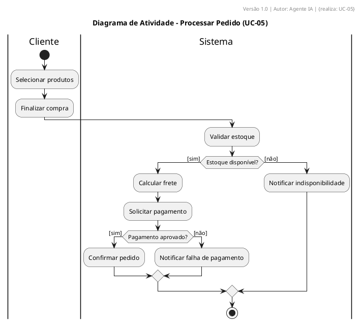

# Activity Diagram Rules (AC1–AC13)

## AC1 – Initial Node
- Single filled circle. PlantUML: `start`.

## AC2 – Decision and Merge
- Diamond with guards in brackets. Always include `[else]` for uncovered cases.

```plantuml
if (Pagamento aprovado?) then ([sim])
  :Confirmar Pedido;
else ([não])
  :Cancelar Pedido;
endif
```

## AC3 – Partitions (Swimlanes)
- Mandatory when more than one responsible party.

```plantuml
|Cliente|
start
:Selecionar produtos;
|Sistema|
:Validar estoque;
```

## AC4 – Action Format
- `Verb + Object`. Examples: `Validar CPF`, `Calcular Frete`.

## AC5 – Object Nodes
- Regular rectangle for data that flows. Must have a type (class from class diagram).

## AC6 – Send / Receive Signals
- Use `<<signal>>` stereotype for async events.

```plantuml
:Confirmar Pedido;
-> send PedidoConfirmado;
```

## AC7 – Traceability to Use Case Steps
- Each action references the use case flow step.
- Example: `:Validar CPF; {passo: 2.1, UC-01}`

## AC8 – Separate Business from System
- Do not mix manual actions with API calls in the same swimlane.

## AC9 – Exception Handling
- Use exception nodes.

```plantuml
:Processar Pagamento;
note right: exception -> :Registrar Falha; -> :Notificar Usuário;
```

## AC10 – Actions Reference Methods
- Each action references the corresponding method. Example: `Pedido.validarEstoque()`.

## AC11 – Swimlanes Instantiate Actors/Components
- Swimlanes must represent actor or component instances from the component diagram.

## AC12 – No Dead Paths
- All actions must be reachable from the initial node.

## AC13 – Every Decision Has a Merge
- Keeps the diagram structured (single entry, single exit).

---

## ✅ Complete Example


