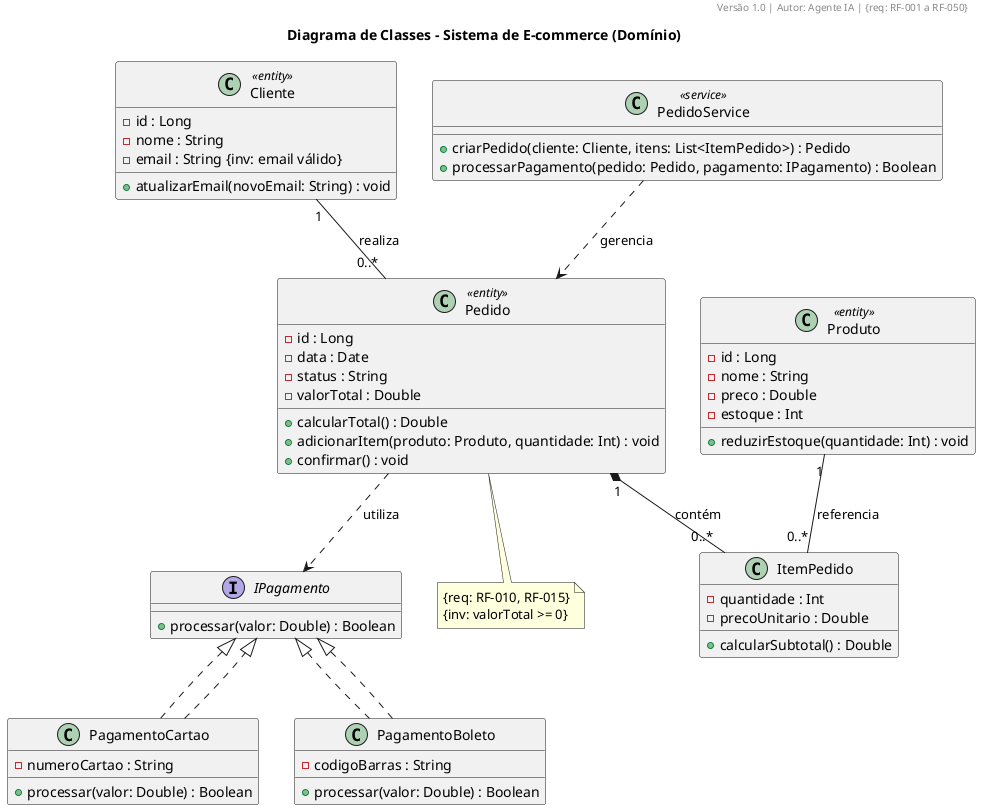

# Class Diagram Rules (CL1–CL15)

## CL1 – Class Compartments
- Name centered in bold. Attributes with visibility and type. Methods with visibility, parameters, and return.

```plantuml
class Pedido {
  - id : Long
  - data : Date
  - status : String
  - valor : Double
  + calcularTotal() : Double
  + adicionarItem(produto: Produto, quantidade: Int) : void
}
```

## CL2 – Attribute Format
- `visibility name : Type [multiplicity] = defaultValue`
- Example: `- saldo : Double = 0.0`

## CL3 – Method Format
- `visibility name(params) : ReturnType`
- Parameter direction: `in`, `out`, `inout`.
- Example: `+ calcularTotal() : Double`

## CL4 – Relationships

| Type | Syntax | Meaning |
|------|--------|---------|
| Association | `--` | Generic link |
| Aggregation | `o--` | Whole-part (hollow diamond) |
| Composition | `*--` | Whole-part with lifecycle (filled diamond) |
| Inheritance | `--|>` | Is-a |
| Realization | `..|>` | Implements interface |
| Dependency | `..>` | Uses |

Always add multiplicity and role names:
```plantuml
Pedido "1" *-- "0..*" ItemPedido : contém
Cliente "1" -- "0..*" Pedido : realiza
Pagamento ..|> IPagamento
```

## CL5 – Interfaces and Abstract Classes
- `<<interface>>` and `<<abstract>>`. Name in italics.

```plantuml
interface IPagamento {
  + processar(valor: Double) : Boolean
}
abstract class PagamentoBase {
  - valor : Double
  + validar() : Boolean
}
```

## CL6 – Architectural Stereotypes
- `<<entity>>`, `<<service>>`, `<<repository>>`, `<<controller>>`.

```plantuml
class Cliente <<entity>>
class PedidoService <<service>>
class PedidoRepository <<repository>>
```

## CL7 – Single Responsibility
- Classes with more than 12 public methods must be split.

## CL8 – Navigability
- Navigation arrow indicates direction: `-->`. Bidirectional without real need is forbidden.

## CL9 – OCL Invariants
- Annotate with `{inv: ...}`.

```plantuml
note bottom of Pedido : {inv: valorTotal >= 0}
```

## CL10 – Association Classes
- Use when the relationship has its own attributes.

```plantuml
class ItemPedido {
  - quantidade : Int
  - precoUnitario : Double
  + calcularSubtotal() : Double
}
Pedido "1" -- "0..*" ItemPedido
Produto "1" -- "0..*" ItemPedido
```

## CL11 – Class Traceability
- Every domain class must have `{req: RF-XXX}`.

## CL12 – Methods Traced to Sequences
- Public methods must be called in at least one sequence diagram.

## CL13 – Responsibility Balance
- No "God classes" or "Anemic classes".

## CL14 – Analysis Diagram (Domain)
- Technology-independent. Do not include `ArrayList`, `Connection`.

## CL15 – Design Diagram
- Include architectural patterns and be consistent with the component diagram.

---

## ✅ Complete Example


