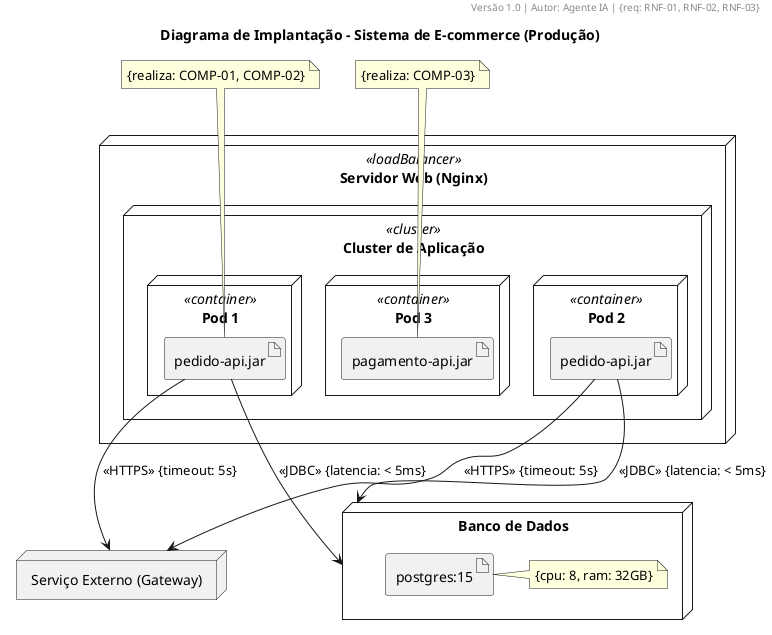

# Deployment Diagram Rules (DP1–DP10)

## DP1 – Node Elements
- 3D box for hardware: `node "Servidor" as Servidor`.
- Execution environment: `node "JVM" <<executionEnvironment>>`.

## DP2 – Artifact
- `artifact "pedido-api.jar" as Artifact`.

## DP3 – Connections with Protocol
- `Servidor --> Banco : <<JDBC>>`.

## DP4 – Deploy Relationships
- `artifact ..> node : <<deploy>>`.

## DP5 – Faithful to Real Infrastructure
- Represent load balancers, clusters, firewalls accurately.

## DP6 – Hardware Properties
- Annotate nodes with `{cpu: 4, ram: 16GB}`.

## DP7 – Communication Constraints
- Annotate connections: `{latencia: < 10ms, banda: 100Mbps}`.

## DP8 – Component-to-Artifact Traceability
- Every artifact must correspond to a component from the component diagram.

## DP9 – Node Justification
- Link nodes to non-functional requirements.

## DP10 – Separate Environments
- Development, test, and production in separate diagrams.

---

## ✅ Complete Example

