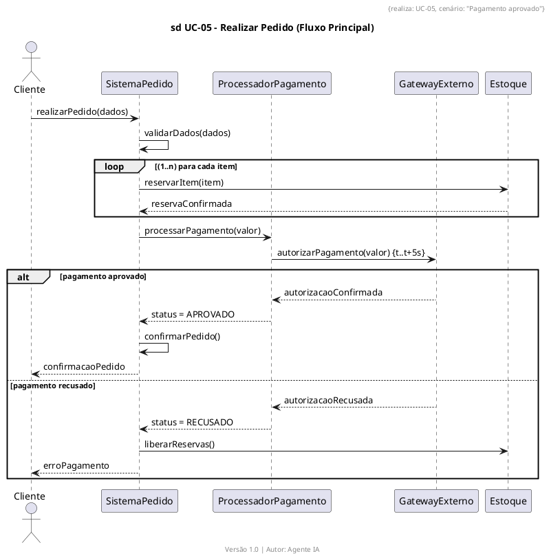

# Sequence Diagram Rules (SQ1–SQ12)

## SQ1 – Header Format
- Format: `sd UC-XX – [Use Case Name] ([Scenario])`.

```plantuml
title sd UC-05 – Realizar Pedido (Fluxo Principal)
```

## SQ2 – Lifelines
- Format: `name:Class` or `:Class`.
- Created objects: `<<create>>`. Destroyed: `<<destroy>>`.

```plantuml
participant "Cliente" as Cliente
participant "SistemaPedido" as SistemaPedido
create ProcessadorPagamento
ProcessadorPagamento --> SistemaPedido : <<create>>
destroy ProcessadorPagamento
```

## SQ3 – Message Types
- Synchronous: `->`. Asynchronous: `->>`. Return: `-->`. Self-call: same lifeline.

```plantuml
Cliente -> SistemaPedido : realizarPedido(dados)
SistemaPedido -> ProcessadorPagamento : processarPagamento(valor)
ProcessadorPagamento --> SistemaPedido : statusPagamento
SistemaPedido --> Cliente : confirmacaoPedido
```

## SQ4 – Combined Fragments
- `alt` / `opt` / `loop` / `break` / `par` / `ref`.

```plantuml
alt pagamento aprovado
  ProcessadorPagamento --> SistemaPedido : status = APROVADO
else pagamento recusado
  ProcessadorPagamento --> SistemaPedido : status = RECUSADO
end

loop (1..n) para cada item
  SistemaPedido -> Estoque : reservarItem(item)
end
```

## SQ5 – Timing Constraints
- Annotate with `{t..t+Xs}`.

```plantuml
ProcessadorPagamento -> GatewayExterno : autorizarPagamento(valor) {t..t+5s}
```

## SQ6 – Message-to-Method Traceability
- Every message must correspond to a method in the target class in the class diagram.

## SQ7 – One Diagram Per Scenario
- Alternative flows and exceptions become separate diagrams.
- Example: `sd UC-05 – Realizar Pedido (Pagamento Recusado)`.

## SQ8 – Typed Lifelines
- Forbidden: `:Object` or `:Generic`. Every lifeline must use a class from the model.

## SQ9 – Use Case Link
- Annotate `{realiza: UC-05, cenário: "Pagamento recusado"}`.

## SQ10 – Business Events
- Messages representing business events use `<<businessEvent>>`.

```plantuml
SistemaPedido -> SistemaPedido : <<businessEvent>> pedidoCriado()
```

## SQ11 – No "Loose Arrows" Diagrams
- Every sequence diagram must show object interaction, not activities.

## SQ12 – Maximum 8 Lifelines
- Above 8 lifelines: split with `ref`.

---

## ✅ Complete Example


