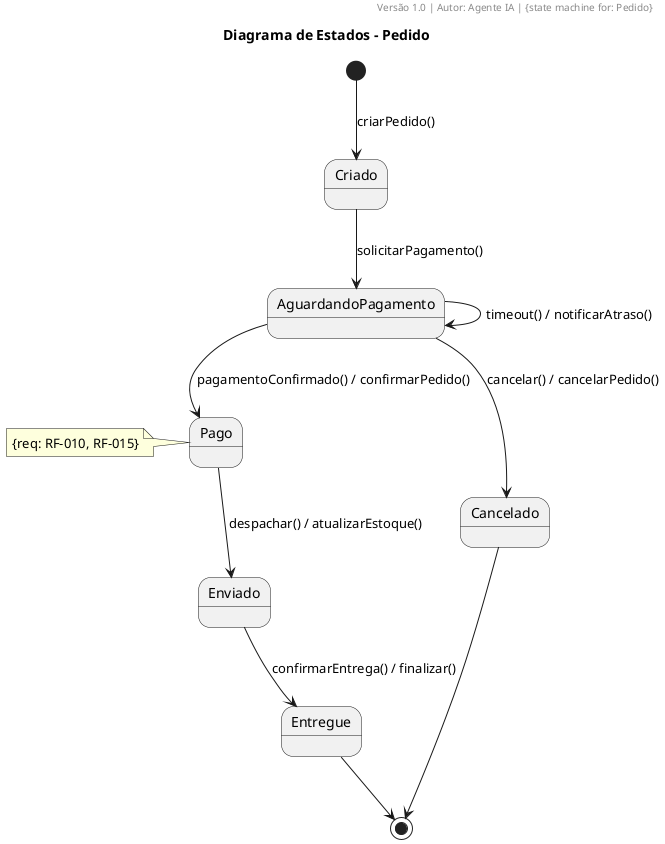

# State Machine Diagram Rules (ST1–ST11)

## ST1 – State Naming
- Rounded rectangle. Name: adjective or participle.
- Examples: `AguardandoPagamento`, `Ativo`, `Cancelado`.

## ST2 – Transition Format
- `[event(params)] / action`

```plantuml
[*] --> AguardandoPagamento
AguardandoPagamento --> Pago : [pagamentoConfirmado()] / confirmarPedido()
```

## ST3 – Initial and Final States
- `[*]` for both start and end.

## ST4 – Composite States
- Use for complex machines with sub-states.

## ST5 – Classes with Significant Behavior Only
- Only model state machines for classes with ≥ 3 distinct states.

## ST6 – Consistency with Sequence Diagrams
- Events must correspond to messages in sequence diagrams.

## ST7 – All Transitions Must Be Testable
- No "magic" transitions without a triggering event.

## ST8 – Link to Class
- Annotate with `{state machine for: ClassX}`.

## ST9 – Event Traceability
- Events must be traceable to operations or use cases.

## ST10 – Full Event Coverage Per State
- For each state, define transitions for all relevant events (including timeouts and self-transitions).

```plantuml
AguardandoPagamento --> AguardandoPagamento : [timeout()] / cancelar()
```

## ST11 – Avoid "God States"
- Prefer orthogonal states or composition over overloaded states.

---

## ✅ Complete Example


