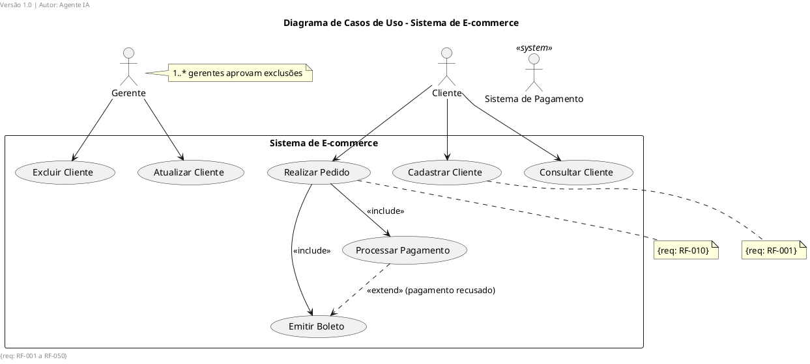

# Use Case Diagram Rules (UC1–UC11)

## UC1 – Use Case Name Format
- Format: `Infinitive Verb + Direct Object`.
- ✅ `Emitir Boleto`, `Cadastrar Cliente`, `Processar Pagamento`
- ❌ `Processar`, `Gerenciar Cliente` (too vague)

```plantuml
usecase "Emitir Boleto" as UC01
usecase "Cadastrar Cliente" as UC02
```

## UC2 – Actor Representation
- Human actors: stick man (PlantUML default).
- System actors: rectangle with `<<system>>`.

```plantuml
actor "Cliente" as Cliente
actor "Sistema de Pagamento" as SistemaPagamento <<system>>
```

## UC3 – System Boundary
- Use `rectangle` or `package` with the system/subsystem name.

```plantuml
rectangle "Sistema de E-commerce" {
  usecase "Emitir Boleto" as UC01
}
```

## UC4 – Relationships
- `<<include>>`: dashed arrow `-->` with stereotype.
- `<<extend>>`: dashed arrow with stereotype + extension condition.
- Generalization: open triangle arrow.

```plantuml
UC01 --> UC03 : <<include>>
UC04 ..> UC01 : <<extend>> (pagamento recusado)
UC02 -up-|> UC01
```

## UC5 – Actor Multiplicity
- Annotate with a note when there are constraints.

```plantuml
note right of Gerente : 1..* gerentes aprovam
```

## UC6 – Use Case Specification
- Generate a complementary document or detailed note with:
  - Primary actor, pre/post-conditions, main flow (numbered steps), alternative flows, business rules.

```plantuml
note top of UC01 : Ator: Cliente | Pré: autenticado | Pós: cliente cadastrado
```

## UC7 – Decompose CRUD
- `Manter Cliente` → `Cadastrar`, `Consultar`, `Atualizar`, `Excluir`.

```plantuml
usecase "Cadastrar Cliente" as UC01
usecase "Consultar Cliente" as UC02
usecase "Atualizar Cliente" as UC03
usecase "Excluir Cliente" as UC04
```

## UC8 – Requirement ID
- Annotate with `{req: RF-XXX}`.

```plantuml
note bottom of UC01 : {req: RF-045}
```

## UC9 – Traceability Matrix
- Generate a Markdown table: `Requirement → Use Case → Scenarios → Sequence Diagrams → Classes`.

## UC10 – No Orphan Use Cases
- Every use case must have a parent requirement and an attached specification.

## UC11 – Actor Coverage
- Every actor that interacts with the system must appear in at least one use case.

---

## ✅ Complete Example


