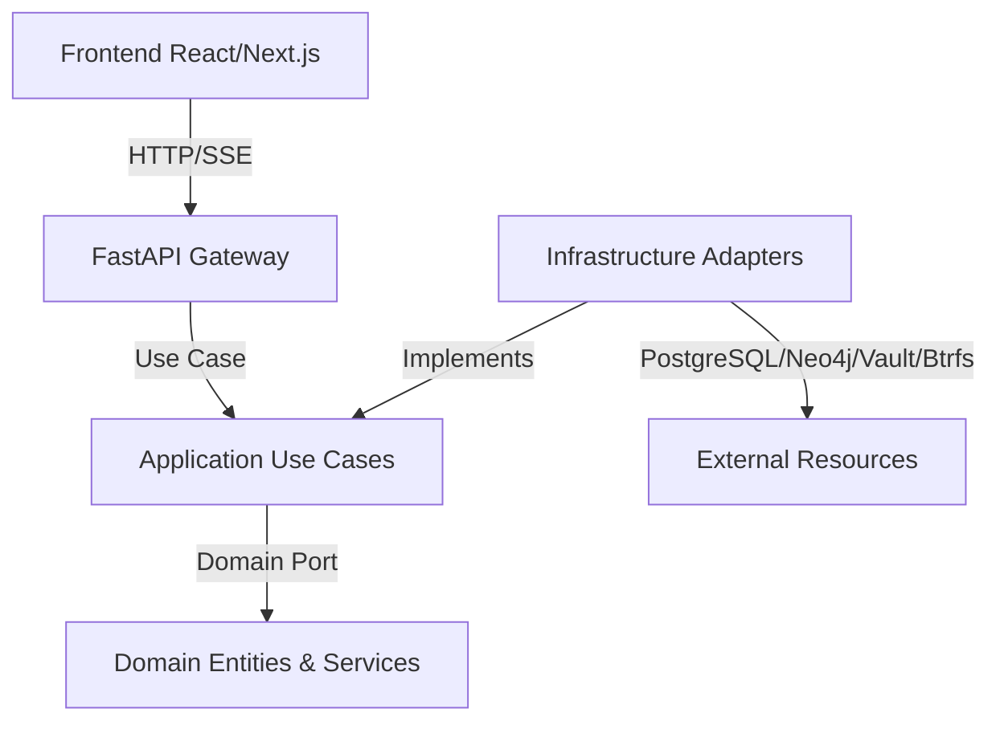

# OpenScientific-Workbench (OSW)

OpenScientific-Workbench is a premium, zero-trust, full-stack scientific agentic platform built using **React/Next.js** on the frontend and **Python/FastAPI** on the backend. It empowers researchers and bioinformatics teams to execute distributed workflows, query biological datasets, and run real bioinformatics computation within a secure sandboxed environment -- a single local Docker Compose stack, no external cloud/cluster required.

---

## 🏛️ Project Architecture

OSW is governed by **Clean Architecture**, **Domain-Driven Design (DDD)**, and strict **Test-Driven Development (TDD)**:



- **Domain Layer (`backend/src/domain/`):** Houses core models (`User`, `Workspace`, `AgentSession`, `ScientificArtifact`) and business services (like `NumericValidator`) isolated from external framework logic.
- **Application Layer (`backend/src/application/`):** Implements orchestrators (use cases like `CreateSession`, `SubmitTask`, `AuditArtifact`, `ForkWorkspace`, `DispatchHPCJob`, `RouteMCPTool`).
- **Infrastructure Layer (`backend/src/infrastructure/`):** Adapters for databases (PostgreSQL/SQLAlchemy, Neo4j GraphRAG), Zero-Trust components (HashiCorp Vault client, `bubblewrap`-sandboxed subprocess executions -- see `infrastructure/sandbox/bubblewrap_driver.py`), storage (Btrfs subvolume snapshots with cross-platform Ntfs fallbacks), and OpenTelemetry tracers.
- **Presentation Layer (`backend/src/presentation/`):** Mounts REST endpoints, SSE streams, global validation handlers, and JWT security gates.

---

## 🧪 Scientific Tool Catalog

OSW ships a Biomni-style "action space": 172 real callable tools the agent orchestrator (and any
direct `POST /api/v1/mcp/tools/call` caller) can reach -- 41 live bio/DB/network adapters (UniProt,
PDB, KEGG, ClinVar, GWAS Catalog, PubMed, ...) plus 131 sandboxed action tools (PCR/cloning
simulation, molecular docking, ODE-based systems-biology models, image-analysis pipelines, and
more), all `bwrap`-sandboxed against a dedicated conda/micromamba toolkit
(`backend/sandbox/environment.yml`) built as its own Docker stage, kept separate from the app's own
dependencies. See **[`backend/docs/tools/README.md`](backend/docs/tools/README.md)** for the full
catalog, the honesty-first Tier A/B/C/D classification (tools that need an unavailable pretrained
checkpoint or GPU cluster fail loudly instead of fabricating a result -- see
`backend/docs/tools/UNSUPPORTED.md`), and how to add a new tool.

---

## 📂 Codebase Site Map

- [`.agents/AGENTS.md`](file:///G:/Programas/OpenScientific-Workbench/.agents/AGENTS.md) — Custom workspace operational rules.
- [`backend/src/domain/entities/`](file:///G:/Programas/OpenScientific-Workbench/backend/src/domain/entities/) — Bounded business entities.
- [`backend/src/domain/ports/`](file:///G:/Programas/OpenScientific-Workbench/backend/src/domain/ports/) — Port contracts (interfaces).
- [`backend/src/application/use_cases/`](file:///G:/Programas/OpenScientific-Workbench/backend/src/application/use_cases/) — Application use cases.
- [`backend/src/infrastructure/`](file:///G:/Programas/OpenScientific-Workbench/backend/src/infrastructure/) — Infrastructure and database adapters.
- [`backend/src/infrastructure/tools/`](file:///G:/Programas/OpenScientific-Workbench/backend/src/infrastructure/tools/) — Sandboxed scientific action tools (see the Scientific Tool Catalog section above).
- [`backend/docs/tools/`](file:///G:/Programas/OpenScientific-Workbench/backend/docs/tools/) — The full tool catalog spec, tiering rules, and data lake manifest.
- [`backend/src/presentation/`](file:///G:/Programas/OpenScientific-Workbench/backend/src/presentation/) — FastAPI route handlers.
- [`frontend/src/app/`](file:///G:/Programas/OpenScientific-Workbench/frontend/src/app/) — Next.js client panels and layouts.
- [`docker-compose.yml`](file:///G:/Programas/OpenScientific-Workbench/docker-compose.yml) — Canonical single-server stack (postgres/redis/neo4j/qdrant + backend/worker/frontend, optional `vault`).

---

## 🔒 Security Mandates & Containment

OSW integrates strict defenses against code injection and unauthorized directory access:
- **CWE-22 / Path Traversal Protection:** Validates workspace mount points at both the Domain and Infrastructure levels (`domain/services/path_guard.py::ensure_safe_relative_path`, reused by every sandboxed tool that accepts a file-path argument) to intercept traversal vectors (`../`, `/etc/`, Windows drive letters).
- **Zero-Trust Token Resolution:** Retrieves 5-minute transient Slurm keys via HashiCorp Vault.
- **Micro-segmentation:** Executing code is sandboxed under `bubblewrap` (unprivileged Linux user-namespace isolation, no privileged container runtime needed) via `BubblewrapSandboxDriver` -- see `infrastructure/sandbox/bubblewrap_driver.py`'s module docstring for the full isolation profile.

---

## 🚀 Running and Testing Locally

### Backend Setup
1. Enter backend directory and activate virtual environment:
   ```bash
   cd backend
   .venv\Scripts\activate
   ```
2. Install packages:
   ```bash
   uv pip install -r pyproject.toml
   ```
3. Run the test suite (100% passing):
   ```bash
   pytest
   ```
4. Run with coverage audit:
   ```bash
   pytest --cov=src --cov-report=term-missing
   ```

### Frontend Setup
1. Enter frontend directory:
   ```bash
   cd frontend
   ```
2. Install Node dependencies (always using `pnpm`):
   ```bash
   pnpm install
   ```
3. Run the production build or dev environment:
   ```bash
   pnpm run build
   pnpm run dev
   ```
4. Run layout and component rendering tests:
   ```bash
   pnpm exec vitest run
   ```