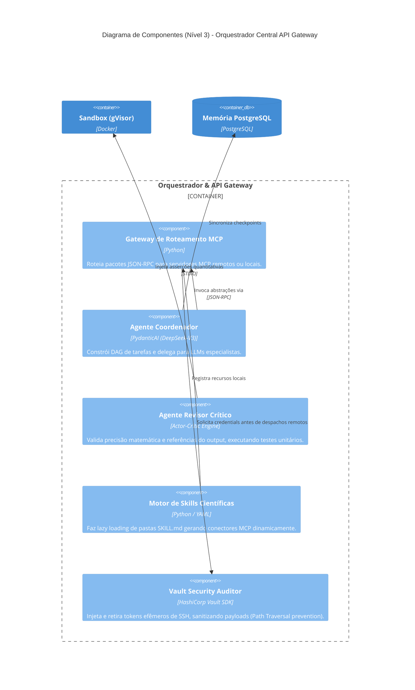

# C4 Modelo Nível 3: Componentes
**ID Documento:** ARCH-C4-L3 | **Status:** Aprovado | **Versão:** 1.0.0

Aprofunda os detalhes do **Orquestrador Central** (API Gateway FastAPI).

```mermaid
C4Component
    title Diagrama de Componentes (Nível 3) - Orquestrador Central API Gateway

    Container_Boundary(api_gateway, "Orquestrador & API Gateway") {
        Component(router_mcp, "Gateway de Roteamento MCP", "Python", "Roteia pacotes JSON-RPC para servidores MCP remotos ou locais.")
        Component(agent_coord, "Agente Coordenador", "PydanticAI (DeepSeek-V3)", "Constrói DAG de tarefas e delega para LLMs especialistas.")
        Component(agent_reviewer, "Agente Revisor Crítico", "Actor-Critic Engine", "Valida precisão matemática e referências do output, executando testes unitários.")
        Component(skill_engine, "Motor de Skills Científicas", "Python / YAML", "Faz lazy loading de pastas SKILL.md gerando conectores MCP dinamicamente.")
        Component(vault_client, "Vault Security Auditor", "HashiCorp Vault SDK", "Injeta e retira tokens efêmeros de SSH, sanitizando payloads (Path Traversal prevention).")
    }

    Container(sandbox_env, "Sandbox (gVisor)", "Docker")
    ContainerDb(db_session, "Memória PostgreSQL", "PostgreSQL")

    Rel(agent_coord, router_mcp, "Invoca abstrações via", "JSON-RPC")
    Rel(agent_reviewer, sandbox_env, "Injeta asserções quantitativas", "STDIO")
    Rel(skill_engine, router_mcp, "Registra recursos locais")
    Rel(agent_coord, db_session, "Sincroniza checkpoints")
    Rel(router_mcp, vault_client, "Solicita credentials antes de despachos remotos")
```
