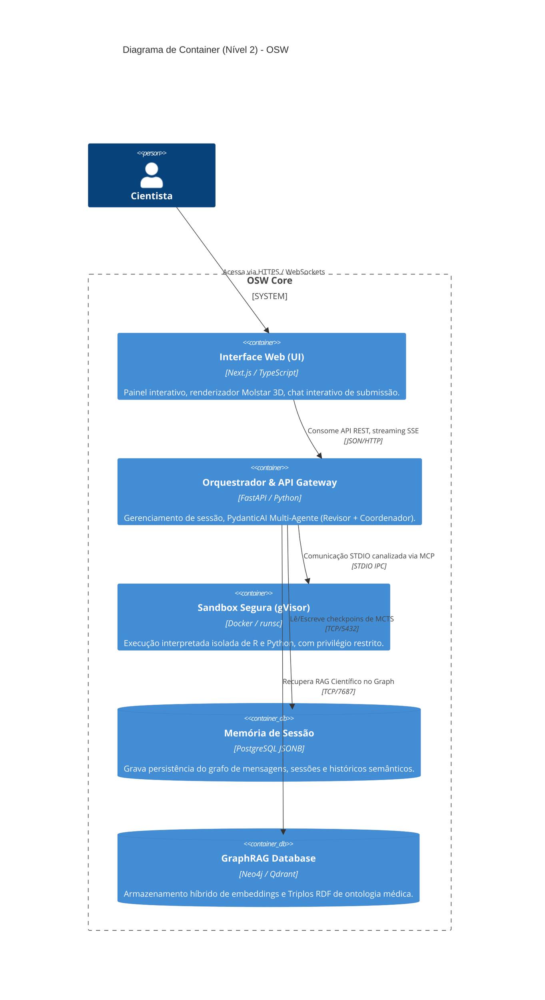

# C4 Modelo Nível 2: Containers
**ID Documento:** ARCH-C4-L2 | **Status:** Aprovado | **Versão:** 1.0.0

Detalha os principais aplicativos e unidades de execução em contêiner dentro do limite do sistema OSW.

