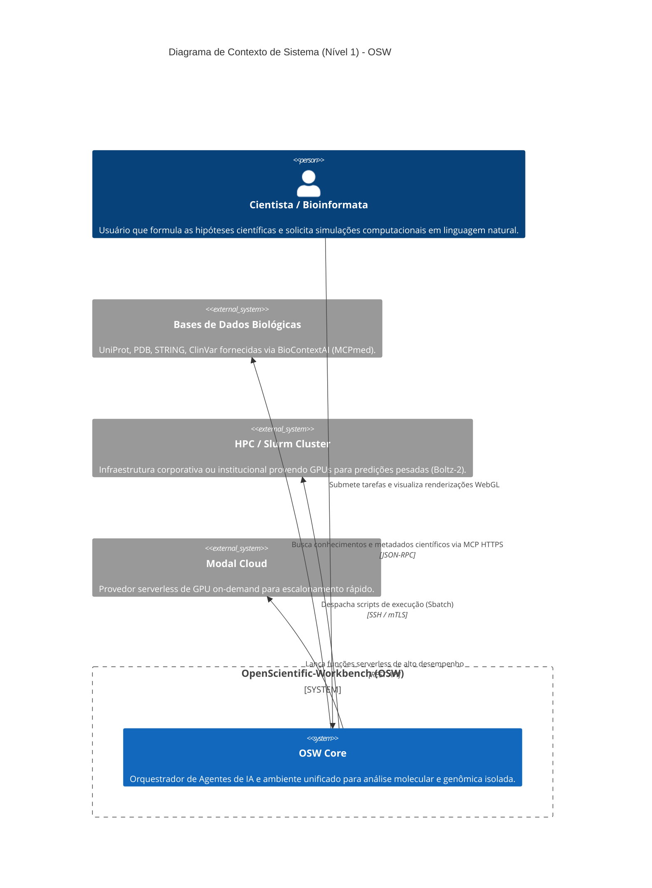

# C4 Modelo Nível 1: Contexto de Sistema
**ID Documento:** ARCH-C4-L1 | **Status:** Aprovado | **Versão:** 1.0.0

Este diagrama mapeia os limites sistêmicos e as interações do Cientista com os ecossistemas HPC e bases de dados externas utilizando o OSW.

