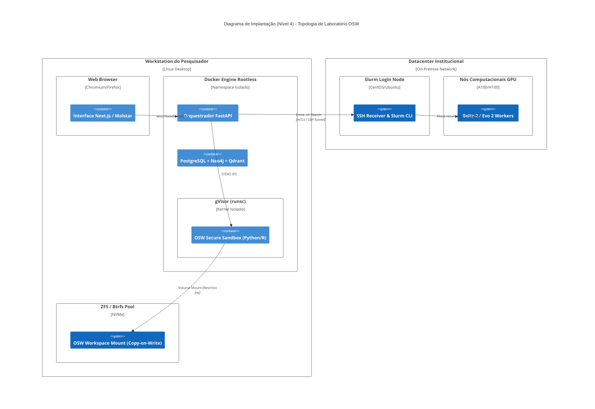

# C4 Modelo Nível 4: Implantação (Deployment)
**ID Documento:** ARCH-C4-L4 | **Status:** Aprovado | **Versão:** 1.0.0

Exibe o mapeamento do software sobre as infraestruturas físicas na topologia de um laboratório de biologia padrão (On-Premises).

