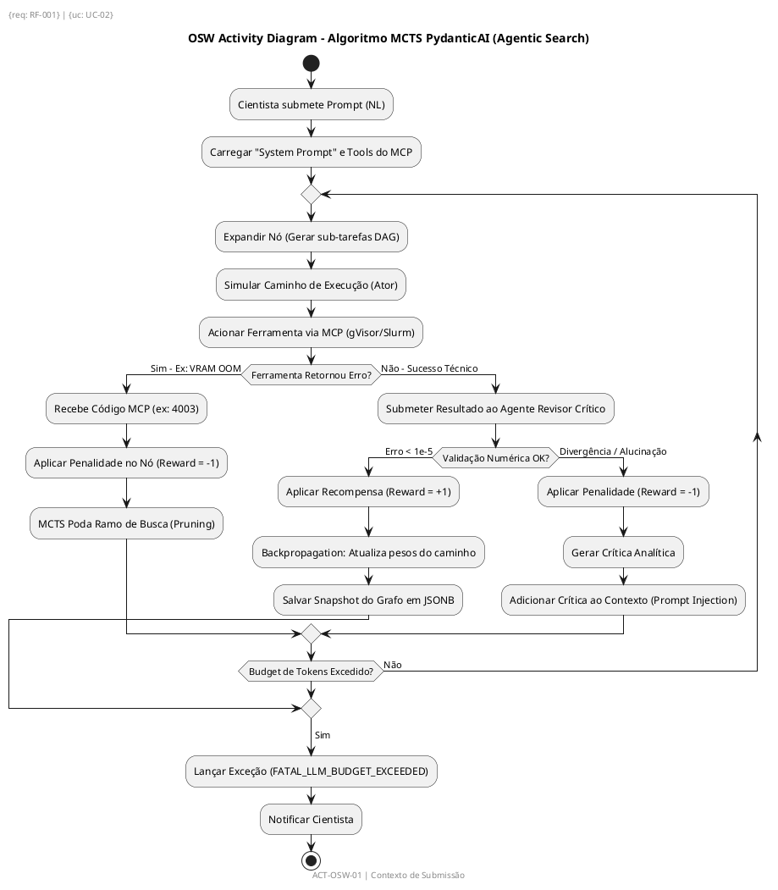

# Diagrama de Atividades: Busca em Árvore (MCTS) do Orquestrador
**ID Documento:** ARCH-MOD-007 | **Status:** Aprovado | **Versão:** 1.0.0

```plantuml
@startuml
title OSW Activity Diagram – Algoritmo MCTS PydanticAI (Agentic Search)
header Version 1.0.0 | Author: AI Architect | Date: 2026-07-01
left header {req: RF-001} | {uc: UC-02}
footer ACT-OSW-01 | Contexto de Submissão

start
:Cientista submete Prompt (NL);
:Carregar "System Prompt" e Tools do MCP;
repeat
    :Expandir Nó (Gerar sub-tarefas DAG);
    :Simular Caminho de Execução (Ator);
    :Acionar Ferramenta via MCP (gVisor/Slurm);
    if (Ferramenta Retornou Erro?) then (Sim - Ex: VRAM OOM)
        :Recebe Código MCP (ex: 4003);
        :Aplicar Penalidade no Nó (Reward = -1);
        :MCTS Poda Ramo de Busca (Pruning);
    else (Não - Sucesso Técnico)
        :Submeter Resultado ao Agente Revisor Crítico;
        if (Validação Numérica OK?) then (Erro < 1e-5)
            :Aplicar Recompensa (Reward = +1);
            :Backpropagation: Atualiza pesos do caminho;
            :Salvar Snapshot do Grafo em JSONB;
            break
        else (Divergência / Alucinação)
            :Aplicar Penalidade (Reward = -1);
            :Gerar Crítica Analítica;
            :Adicionar Crítica ao Contexto (Prompt Injection);
        endif
    endif
repeat while (Budget de Tokens Excedido?) is (Não)
->Sim;
:Lançar Exceção (FATAL_LLM_BUDGET_EXCEEDED);
:Notificar Cientista;
stop
@enduml
```
