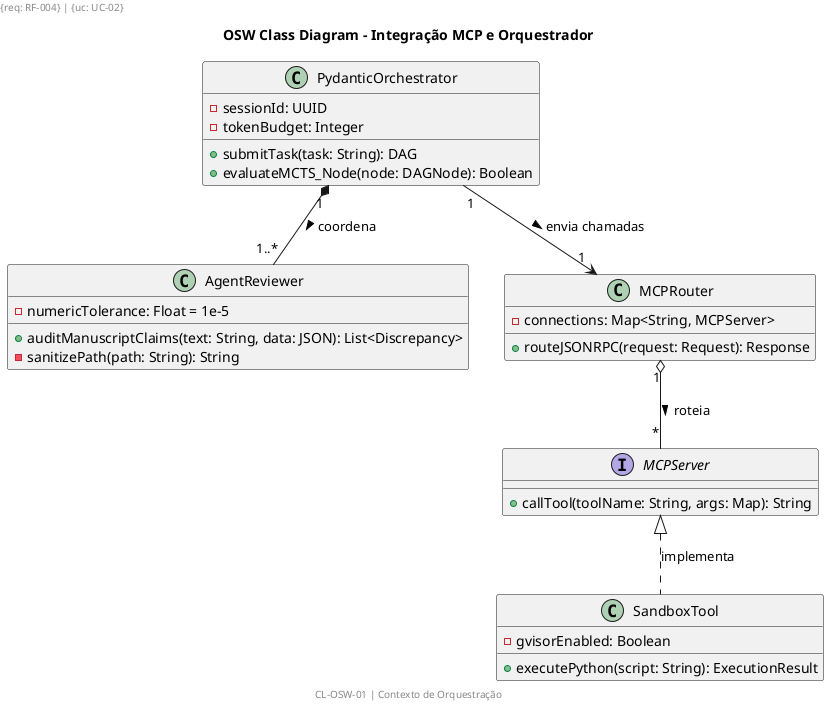

# Diagrama de Classes
**ID Documento:** ARCH-MOD-004 | **Status:** Aprovado | **Versão:** 1.0.0

```plantuml
@startuml
title OSW Class Diagram – Integração MCP e Orquestrador
header Version 1.0.0 | Author: AI Architect | Date: 2026-07-01
left header {req: RF-004} | {uc: UC-02}
footer CL-OSW-01 | Contexto de Orquestração

class PydanticOrchestrator {
    - sessionId: UUID
    - tokenBudget: Integer
    + submitTask(task: String): DAG
    + evaluateMCTS_Node(node: DAGNode): Boolean
}

class AgentReviewer {
    - numericTolerance: Float = 1e-5
    + auditManuscriptClaims(text: String, data: JSON): List<Discrepancy>
    - sanitizePath(path: String): String
}

class MCPRouter {
    - connections: Map<String, MCPServer>
    + routeJSONRPC(request: Request): Response
}

interface MCPServer {
    + callTool(toolName: String, args: Map): String
}

class SandboxTool {
    - gvisorEnabled: Boolean
    + executePython(script: String): ExecutionResult
}

PydanticOrchestrator "1" *-- "1..*" AgentReviewer : coordena >
PydanticOrchestrator "1" --> "1" MCPRouter : envia chamadas >
MCPRouter "1" o-- "*" MCPServer : roteia >
MCPServer <|.. SandboxTool : implementa
@enduml
```
