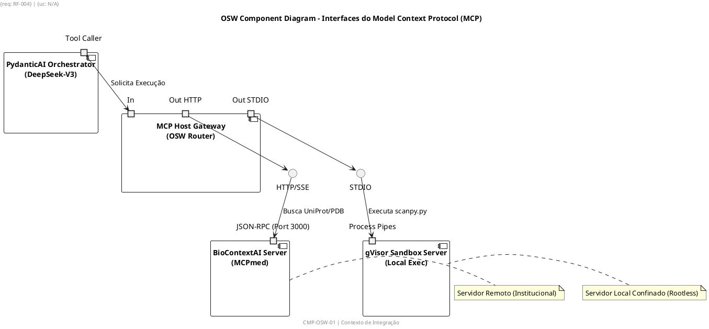

# Diagrama de Componentes: Protocolo MCP e Integrações
**ID Documento:** ARCH-MOD-009 | **Status:** Aprovado | **Versão:** 1.0.0

```plantuml
@startuml
title OSW Component Diagram – Interfaces do Model Context Protocol (MCP)
header Version 1.0.0 | Author: AI Architect | Date: 2026-07-01
left header {req: RF-004} | {uc: N/A}
footer CMP-OSW-01 | Contexto de Integração

skinparam componentStyle uml2

interface "HTTP/SSE" as SSE
interface "STDIO" as STDIO

component "PydanticAI Orchestrator\n(DeepSeek-V3)" as LLM {
    port "Tool Caller" as LLM_Tool
}

component "MCP Host Gateway\n(OSW Router)" as Router {
    port "In" as R_In
    port "Out HTTP" as R_Out_HTTP
    port "Out STDIO" as R_Out_STDIO
}

component "BioContextAI Server\n(MCPmed)" as BioMCP {
    port "JSON-RPC (Port 3000)" as BioPort
}

component "gVisor Sandbox Server\n(Local Exec)" as SandboxMCP {
    port "Process Pipes" as PipePort
}

LLM_Tool -down-> R_In : Solicita Execução
R_Out_HTTP -down-> SSE
SSE -down-> BioPort : "Busca UniProt/PDB"
R_Out_STDIO -down-> STDIO
STDIO -down-> PipePort : "Executa scanpy.py"

note right of BioMCP : Servidor Remoto (Institucional)
note right of SandboxMCP : Servidor Local Confinado (Rootless)
@enduml
```
