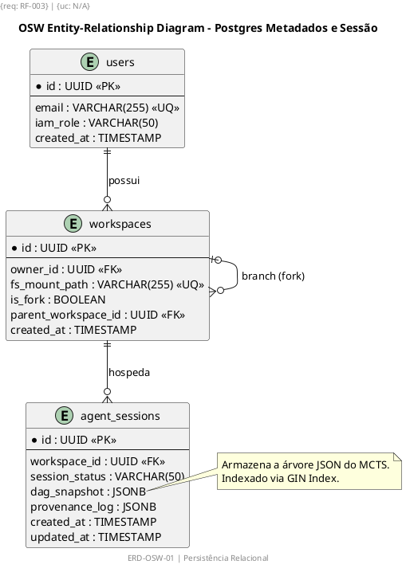

# Diagrama de Entidade-Relacionamento (ERD) Físico
**ID Documento:** ARCH-MOD-010 | **Status:** Aprovado | **Versão:** 1.0.0

```plantuml
@startuml
title OSW Entity-Relationship Diagram – Postgres Metadados e Sessão
header Version 1.0.0 | Author: AI Architect | Date: 2026-07-01
left header {req: RF-003} | {uc: N/A}
footer ERD-OSW-01 | Persistência Relacional

' Definição de Entidades
entity "users" as users {
  * id : UUID <<PK>>
  --
  email : VARCHAR(255) <<UQ>>
  iam_role : VARCHAR(50)
  created_at : TIMESTAMP
}

entity "workspaces" as workspaces {
  * id : UUID <<PK>>
  --
  owner_id : UUID <<FK>>
  fs_mount_path : VARCHAR(255) <<UQ>>
  is_fork : BOOLEAN
  parent_workspace_id : UUID <<FK>>
  created_at : TIMESTAMP
}

entity "agent_sessions" as sessions {
  * id : UUID <<PK>>
  --
  workspace_id : UUID <<FK>>
  session_status : VARCHAR(50)
  dag_snapshot : JSONB
  provenance_log : JSONB
  created_at : TIMESTAMP
  updated_at : TIMESTAMP
}

' Relacionamentos
users ||--o{ workspaces : possui
workspaces |o--o{ workspaces : branch (fork)
workspaces ||--o{ sessions : hospeda

note right of sessions::dag_snapshot
  Armazena a árvore JSON do MCTS.
  Indexado via GIN Index.
end note
@enduml
```
