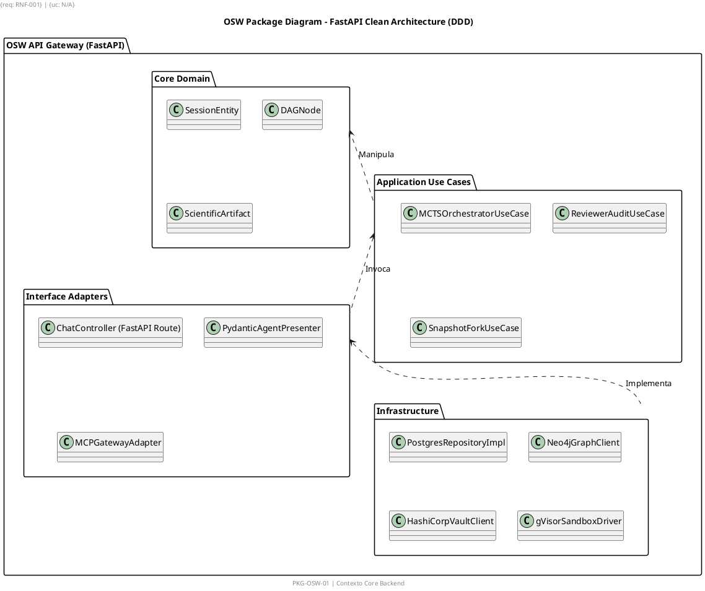

# Diagrama de Pacotes: Clean Architecture do Core
**ID Documento:** ARCH-MOD-008 | **Status:** Aprovado | **Versão:** 1.0.0

```plantuml
@startuml
title OSW Package Diagram – FastAPI Clean Architecture (DDD)
header Version 1.0.0 | Author: AI Architect | Date: 2026-07-01
left header {req: RNF-001} | {uc: N/A}
footer PKG-OSW-01 | Contexto Core Backend

package "OSW API Gateway (FastAPI)" {
    package "Core Domain" as Domain {
        class "SessionEntity"
        class "DAGNode"
        class "ScientificArtifact"
    }

    package "Application Use Cases" as Application {
        class "MCTSOrchestratorUseCase"
        class "ReviewerAuditUseCase"
        class "SnapshotForkUseCase"
    }

    package "Interface Adapters" as Adapters {
        class "ChatController (FastAPI Route)"
        class "PydanticAgentPresenter"
        class "MCPGatewayAdapter"
    }

    package "Infrastructure" as Infra {
        class "PostgresRepositoryImpl"
        class "Neo4jGraphClient"
        class "HashiCorpVaultClient"
        class "gVisorSandboxDriver"
    }
}

Infra .up.> Adapters : Implementa
Adapters .up.> Application : Invoca
Application .up.> Domain : Manipula

' Regra de Dependência: Camadas externas dependem das internas.
@enduml
```
