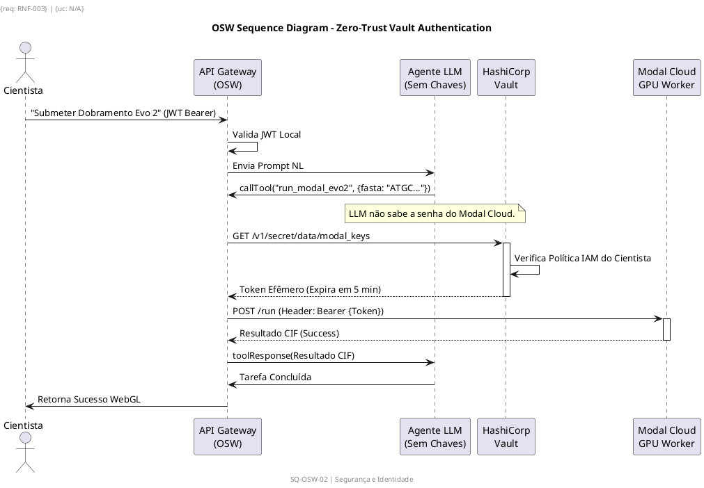

# Diagrama de Sequência: Delegação Efêmera (Zero-Trust)
**ID Documento:** ARCH-MOD-011 | **Status:** Aprovado | **Versão:** 1.0.0

```plantuml
@startuml
title OSW Sequence Diagram – Zero-Trust Vault Authentication
header Version 1.0.0 | Author: AI Architect | Date: 2026-07-01
left header {req: RNF-003} | {uc: N/A}
footer SQ-OSW-02 | Segurança e Identidade

actor Cientista
participant "API Gateway\n(OSW)" as Gateway
participant "Agente LLM\n(Sem Chaves)" as LLM
participant "HashiCorp\nVault" as Vault
participant "Modal Cloud\nGPU Worker" as Modal

Cientista -> Gateway: "Submeter Dobramento Evo 2" (JWT Bearer)
Gateway -> Gateway: Valida JWT Local
Gateway -> LLM: Envia Prompt NL

LLM -> Gateway: callTool("run_modal_evo2", {fasta: "ATGC..."})
note over LLM: LLM não sabe a senha do Modal Cloud.

Gateway -> Vault: GET /v1/secret/data/modal_keys
activate Vault
Vault -> Vault: Verifica Política IAM do Cientista
Vault --> Gateway: Token Efêmero (Expira em 5 min)
deactivate Vault

Gateway -> Modal: POST /run (Header: Bearer {Token})
activate Modal
Modal --> Gateway: Resultado CIF (Success)
deactivate Modal

Gateway -> LLM: toolResponse(Resultado CIF)
LLM -> Gateway: Tarefa Concluída
Gateway -> Cientista: Retorna Sucesso WebGL
@enduml
```
