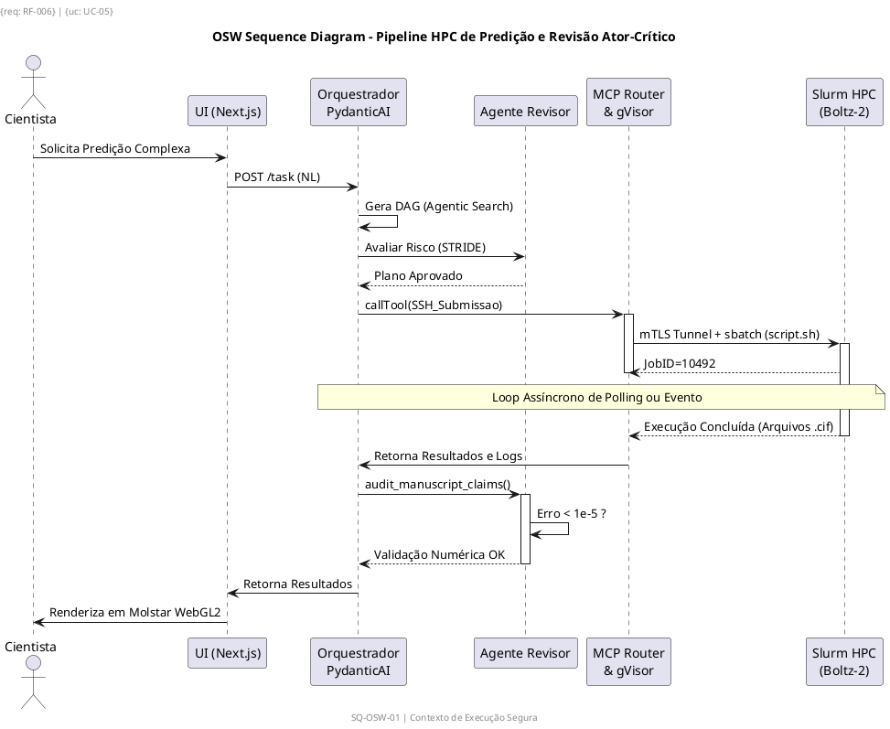

# Diagrama de Sequência
**ID Documento:** ARCH-MOD-005 | **Status:** Aprovado | **Versão:** 1.0.0

```plantuml
@startuml
title OSW Sequence Diagram – Pipeline HPC de Predição e Revisão Ator-Crítico
header Version 1.0.0 | Author: AI Architect | Date: 2026-07-01
left header {req: RF-006} | {uc: UC-05}
footer SQ-OSW-01 | Contexto de Execução Segura

actor Cientista
participant "UI (Next.js)" as UI
participant "Orquestrador\nPydanticAI" as Orch
participant "Agente Revisor" as Reviewer
participant "MCP Router\n& gVisor" as MCP
participant "Slurm HPC\n(Boltz-2)" as HPC

Cientista -> UI: Solicita Predição Complexa
UI -> Orch: POST /task (NL)
Orch -> Orch: Gera DAG (Agentic Search)

Orch -> Reviewer: Avaliar Risco (STRIDE)
Reviewer --> Orch: Plano Aprovado

Orch -> MCP: callTool(SSH_Submissao)
activate MCP
MCP -> HPC: mTLS Tunnel + sbatch (script.sh)
activate HPC
HPC --> MCP: JobID=10492
deactivate MCP

note over Orch, HPC: Loop Assíncrono de Polling ou Evento
HPC --> MCP: Execução Concluída (Arquivos .cif)
deactivate HPC
MCP -> Orch: Retorna Resultados e Logs

Orch -> Reviewer: audit_manuscript_claims()
activate Reviewer
Reviewer -> Reviewer: Erro < 1e-5 ?
Reviewer --> Orch: Validação Numérica OK
deactivate Reviewer

Orch -> UI: Retorna Resultados
UI -> Cientista: Renderiza em Molstar WebGL2
@enduml
```
