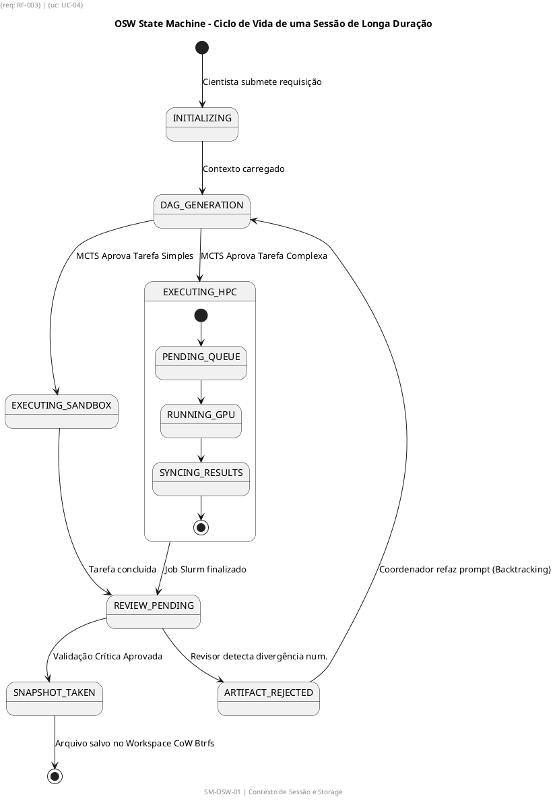

# Diagrama de Máquina de Estados
**ID Documento:** ARCH-MOD-006 | **Status:** Aprovado | **Versão:** 1.0.0

```plantuml
@startuml
title OSW State Machine – Ciclo de Vida de uma Sessão de Longa Duração
header Version 1.0.0 | Author: AI Architect | Date: 2026-07-01
left header {req: RF-003} | {uc: UC-04}
footer SM-OSW-01 | Contexto de Sessão e Storage

[*] --> INITIALIZING : Cientista submete requisição
INITIALIZING --> DAG_GENERATION : Contexto carregado
DAG_GENERATION --> EXECUTING_SANDBOX : MCTS Aprova Tarefa Simples
DAG_GENERATION --> EXECUTING_HPC : MCTS Aprova Tarefa Complexa

EXECUTING_SANDBOX --> REVIEW_PENDING : Tarefa concluída
EXECUTING_HPC --> REVIEW_PENDING : Job Slurm finalizado

REVIEW_PENDING --> ARTIFACT_REJECTED : Revisor detecta divergência num.
ARTIFACT_REJECTED --> DAG_GENERATION : Coordenador refaz prompt (Backtracking)

REVIEW_PENDING --> SNAPSHOT_TAKEN : Validação Crítica Aprovada
SNAPSHOT_TAKEN --> [*] : Arquivo salvo no Workspace CoW Btrfs

state EXECUTING_HPC {
  [*] --> PENDING_QUEUE
  PENDING_QUEUE --> RUNNING_GPU
  RUNNING_GPU --> SYNCING_RESULTS
  SYNCING_RESULTS --> [*]
}
@enduml
```
