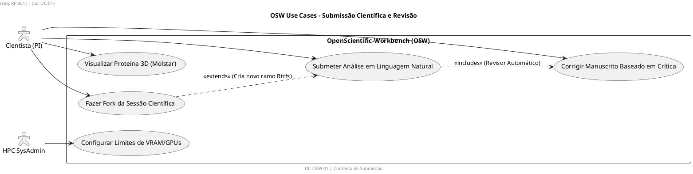

# Diagramas de Casos de Uso
**ID Documento:** ARCH-MOD-003 | **Status:** Aprovado | **Versão:** 1.0.0

```plantuml
@startuml
title OSW Use Cases – Submissão Científica e Revisão
header Version 1.0.0 | Author: AI Architect | Date: 2026-07-01
left header {req: RF-001} | {uc: UC-01}
footer UC-OSW-01 | Contexto de Submissão

left to right direction
skinparam packageStyle rectangle
skinparam actorStyle hollow

actor "Cientista (PI)" as scientist
actor "HPC SysAdmin" as admin

package "OpenScientific-Workbench (OSW)" {
    usecase "Configurar Limites de VRAM/GPUs" as UC1
    usecase "Submeter Análise em Linguagem Natural" as UC2
    usecase "Visualizar Proteína 3D (Molstar)" as UC3
    usecase "Fazer Fork da Sessão Científica" as UC4
    usecase "Corrigir Manuscrito Baseado em Crítica" as UC5
}

scientist --> UC2
scientist --> UC3
scientist --> UC4
scientist --> UC5

admin --> UC1

UC2 ..> UC5 : <<includes>> (Revisor Automático)
UC4 ..> UC2 : <<extends>> (Cria novo ramo Btrfs)
@enduml
```
